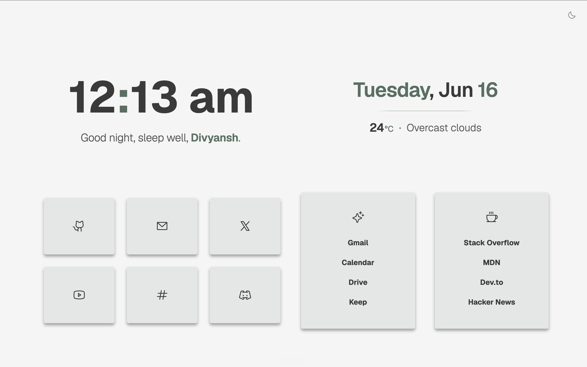
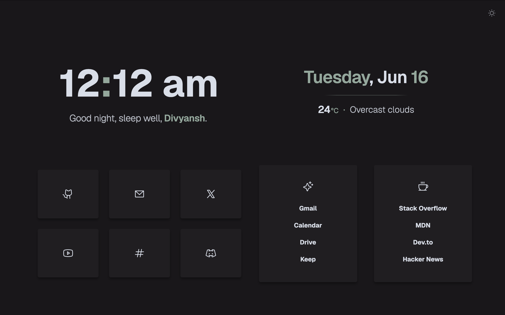

<div align="center">

# सुकून

**S U K O O N**

A minimal, premium startpage with swiss typography and calm aesthetics.

</div>

<br>

<div align="center">
  
  
</div>

---

<div align="center">
  
  <br>
  Staggered entry animations, typewriter greeting, and smooth theme toggle.
</div>

<br>

---

<br>

## Features

### Typography

- **Geist variable font** loaded globally for clean, modern rendering
- **Swiss date and weather stack** — centered typographic layout mirroring the clock
- **Phosphor Icons** via fast CDN class-based rendering

### Animations

- **Typewriter greeting** with randomized keystroke speed, punctuation pauses, and a smart fading caret
- **Staggered card entry** — cards fade and slide up sequentially on page load
- **Expanding underline hovers** on list links — center-expanding effect
- **Tactile button feedback** — scale-down on theme toggle click

### Theming

- **Dark and light mode** with smooth 180° icon rotation
- **Symmetric accent color system** across clock separator, greeting name, date elements, and weather details
- **Auto-switch** by OS preference or time of day

### Customization

- Three layout modes: `bento`, `lists`, `buttons`
- Configurable 12h/24h clock with zero-padding
- Minimal weather widget via OpenWeatherMap
- Full control via `config.js`

---

## Quick Start

1. **Fork** this repo
2. **Edit** `config.js` — add your name, links, and weather API key
3. **Enable** GitHub Pages → Settings → Pages → Source: `master`

Set `https://<your-username>.github.io/sukoon/` as your browser homepage.

---

## Installation

### GitHub Pages

1. Fork this repo
2. Edit `config.js` with your name, links, and [OpenWeatherMap](https://openweathermap.org/) API key
3. Go to Settings → Pages → Source and select `master`
4. Set the URL as your browser homepage

### Local

```bash
git clone https://github.com/divyanshchandhok/sukoon.git
cd sukoon
open index.html
```

Edit `config.js` to personalize.

### Docker

```bash
docker-compose up -d
```

Or manually:

```bash
docker run -it -d -p 80:80 -v ./config.js:/usr/share/nginx/html/config.js sukoon
```

---

## Customization

All configuration lives in `config.js`.

### General

| Setting | Default | Description |
|---|---|---|
| `name` | `'YourName'` | Your name, shown in the greeting |
| `imageBackground` | `false` | Use `assets/background.jpg` as background |
| `openInNewTab` | `true` | Open links in new tabs |
| `twelveHourFormat` | `true` | 12h clock; set `false` for 24h |

### Greetings

| Setting | Default |
|---|---|
| `greetingMorning` | `'Good morning,'` |
| `greetingAfternoon` | `'Good afternoon,'` |
| `greetingEvening` | `'Good evening,'` |
| `greetingNight` | `'Good night, sleep well.'` |

### Layout

| Setting | Default | Description |
|---|---|---|
| `layout` | `'bento'` | `'bento'`, `'lists'`, or `'buttons'` |

### Weather

Get an API key from [OpenWeatherMap](https://openweathermap.org/).

| Setting | Default | Description |
|---|---|---|
| `weatherKey` | `''` | Your OpenWeatherMap API key |
| `weatherUnit` | `'C'` | `'C'` for Celsius, `'F'` for Fahrenheit |
| `language` | `'en'` | [Language code](https://openweathermap.org/current#multi) |
| `trackLocation` | `true` | Use browser geolocation |
| `defaultLatitude` | `'0.0'` | Fallback latitude |
| `defaultLongitude` | `'0.0'` | Fallback longitude |

### Theme

| Setting | Default | Description |
|---|---|---|
| `autoChangeTheme` | `true` | Enable automatic theme switching |
| `changeThemeByOS` | `true` | Follow OS dark/light preference |
| `changeThemeByHour` | `false` | Switch by time of day |
| `hourDarkThemeActive` | `'18:30'` | Dark mode activates after this time |
| `hourDarkThemeInactive` | `'07:00'` | Dark mode deactivates after this time |

### Colors

Edit CSS variables in `app.css`:

```css
:root {
  --accent: #537060;      /* Forest sage green */
  --background: #f5f5f5;  /* Background */
  --cards: #e4e6e6;       /* Card surfaces */
  --fg: #3a3a3a;          /* Text color */
  --sfg: #494949;         /* Secondary text */
}

.darktheme {
  --accent: #8fa89b;      /* Eucalyptus pale green */
  --background: #19171a;
  --cards: #201e21;
  --fg: #d8dee9;
  --sfg: #2c292e;
}
```

### Links

Edit `firstButtonsContainer`, `secondButtonsContainer`, `firstlistsContainer`, and `secondListsContainer` in `config.js`. Use [Phosphor Icons](https://phosphoricons.com/) names (e.g., `github-logo`, `spotify-logo`).

---

## Credits

Sukoon is based on [Bento](https://github.com/migueravila/bento) by [Miguel Avila](https://avila.sh), licensed under [GPL-3.0](https://www.gnu.org/licenses/gpl-3.0).

## License

[GPL-3.0](License)
